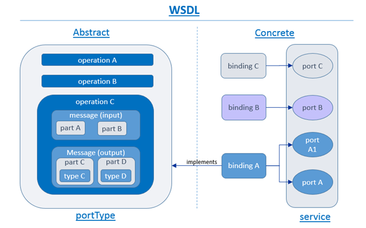
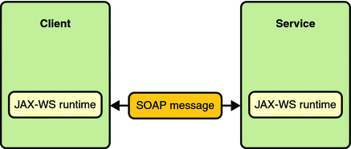
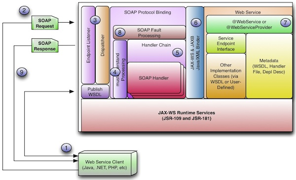
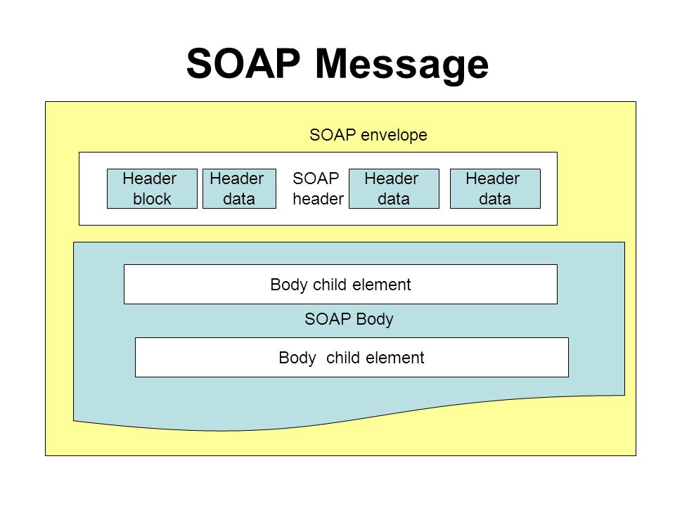

# JAX-WS
JAX-WS (Java API for XML Web Services) is an API used to create and consume web services, particularly __SOAP__ services. It is part of the __JEE__ platform. It uses annotations to describe the web service and consuming clients. 

## WSDL
WSDL (__Web Services Description Language__) is an __XML-based__ language used to describe the functionality of a web service. The __JAX-WS__ specification defines a __Java-to-WSDL mapping__ which determines how WSDL operations are bound to Java methods.

The WSDL specification contains following major elements:
- Types: defines the data types used by the services, using XML Schema
- Message: defines the data elements for each operation
- PortType: describes the operations that can be performed and the messages involved
- Binding: defines the protocol and data format for each PortType

The following is an example of a skeleton WSDL file:

```xml
<definitions>
    <types>
        data type definitions
    </types>
    <message>
        definition of the data being communicated
    </message>
    <portType>
        set of operations
    </portType>
    <binding>
        protocol and data format specification
    </binding>
</definitions> 
```

### The Types element
Mosten often, a web service will have input and output types. If a web service has more than one operation, then each operation might have its own input and output type. 



Below you can find an example of a defined Types element:

```xml
<types>
    <xs:schema
        xmlns:xs=        "http://www.w3.org/2001/XMLSchema"
        targetNamespace= "http://jenkov.com/MyService/schema"
        xmlns:tns=       "http://jenkov.com/MyService/schema"
    >
        <!-- Input type of type 'typeLatestTutorialRequest' -->
        <xs:element name="latestTutorialRequest" type="typeLatestTutorialRequest"/>
        <!-- Definition of new data type -->
        <xs:complexType name="typeLatestTutorialRequest">
          <xs:sequence>
            <xs:element  name="date"   type="xs:date"/>
          </xs:sequence>
        </xs:complexType>
        <!-- Output type -->
        <xs:element name="latestTutorialResponse" type="xs:string"/>
        <!-- Fault type -->
        <xs:element name="invalidDateError" type="xs:string"/>
    </xs:schema>
  </types>
```

In the example, __latestTutorialRequest__ is our input type. This element is of type __typeLatestTutorialRequest__. __typeLatestTutorialRequest__ on its turn can contain a date. The __latestTutorialResponse__ element is our output type of type __String__. We also define a fault element named __invalidDateError__ of type __String__.

In XML Schema you can define all kinds of elements and types. However, only elements declared as single elements and as top level elements can be referred to by the WSDL file. In other words, you could not use the __typeLatestTutorialRequest__ by itself as an input or output type of an operation, you'd have to use the __latestTutorialRequest__ element. 

### The Message element
Each web service has two types of messages; __input__ and __output__ messages. The __input__ message describes the parameters for each __operation__ of the __webservice__ while the __output__ message defines the __return data__ of the operations. Each message contains one or more __part__ elements to describe every parameter or return value of the message. 

Below is an example of a message element definition:

```xml
<message name = "SayHelloRequest">
   <part name = "firstName" type = "xsd:string"/>
</message>
<message name = "SayHelloResponse">
   <part name = "greeting" type = "xsd:string"/>
</message>
```

### The portType element
The __portType__ element combines multiple __message__ elements to form a complete __one-way__ or __round-trip__ operation. For example, a portType could combine a __request__ and a __response__ message into a single request/response operation:

```xml
<portType name = "Hello_PortType">
   <operation name = "sayHello">
      <input message = "tns:SayHelloRequest"/>
      <output message = "tns:SayHelloResponse"/>
   </operation>
</portType>
```

We can define four basic types of operations:
- One-way: define messages to be received without giving a response
```xml
<wsdl:definitions> 
   <wsdl:portType>
      <wsdl:operation name = "nmtoken">
         <wsdl:input name = "nmtoken"? message = "qname"/>
      </wsdl:operation>
   </wsdl:portType>
</wsdl:definitions>
```
- Request-response: the service receives a message and sends a response
```xml
<wsdl:definitions>
   <wsdl:portType>
      <wsdl:operation name = "nmtoken" parameterOrder = "nmtokens">
         <wsdl:input name = "nmtoken"? message = "qname"/>
         <wsdl:output name = "nmtoken"? message = "qname"/>
         <wsdl:fault name = "nmtoken" message = "qname"/>
      </wsdl:operation>
   </wsdl:portType>
</wsdl:definitions>
```
- Sollicit-response: the service sends a message and receives a response
```xml
<wsdl:definitions>
   <wsdl:portType> 
      <wsdl:operation name = "nmtoken" parameterOrder = "nmtokens">
         <wsdl:output name = "nmtoken"? message = "qname"/>
         <wsdl:input name = "nmtoken"? message = "qname"/>
         <wsdl:fault name = "nmtoken" message = "qname"/>
      </wsdl:operation>
   </wsdl:portType>
</wsdl:definitions>
```
- Notification: the service sends a message without expecting a response
```xml
<wsdl:definitions .... >
   <wsdl:portType .... > *
      <wsdl:operation name = "nmtoken">
         <wsdl:output name = "nmtoken"? message = "qname"/>
      </wsdl:operation>
   </wsdl:portType>
</wsdl:definitions>
```

### The Bindings element
The SOAP specification defines the structure of the SOAP messages, not how they are exchanged. This is taken care of by the so-called __bindings__. A binding specifies the requirements to send and receive __portType__ operation requests and responses. Examples of requirements are: authentication, the transfer protocol used (such as HTTP), signatures, et cetera. A binding can either be a __RPC__ (Remote Procedure Call) style binding or a __document__ style binding. A binding can also have an __encoded__ or a __literal__ use. This gives us four types of bindings:
- RPC encoded
- Document encoded
- RPC literal
- Document literal

An example binding could look like this:

```xml
<binding name = "Hello_Binding" type = "tns:Hello_PortType">
   <soap:binding style = "rpc" transport = "http://schemas.xmlsoap.org/soap/http"/>
   <operation name = "sayHello">
      <soap:operation soapAction = "sayHello"/>
      <input>
         <soap:body encodingStyle = "http://schemas.xmlsoap.org/soap/encoding/"/>
      </input>			
      <output>
         <soap:body encodingStyle = "http://schemas.xmlsoap.org/soap/encoding/"/>
      </output>
   </operation>
</binding>
```

As you can see, our __binding__ element has an attribute named __type__. This type refers to the portType definition for which we are describing the requirements in our binding. The __soap:binding__ element specifies that the SOAP protocol is used. The __style__ attribute defines the style of our SOAP message format, which is __rpc__ in this case. The __transport__ attribute specifies the operation to be transmitted over HTTP. In the __operation__ element we bind the specific operation defined in the mapped __portType__ to the requirements. 

## Server side
The web service exposes one or more endpoints for the client to consume. A service can be published over __HTTP__, __SMTP__, ... and can use several message protocols such as __SOAP__ and __REST__. As mentioned, __JAX-WS__ is focused on the use of SOAP. JAX-WS takes care of the mapping of the return values of the exposed operations to __SOAP messages__. For example; our exposed operation called "getName" returns a String. JAX-WS will then convert this returned String to a SOAP message following the correct structure according to the specification __at runtime__.

JAX-WS also takes care of the creation of the __WSDL file__ when you have defined your web service. It will automatically check the published endpoints and create a WSDL in accordance with your defined operations, mappings, types et cetera. This WSDL will also be published by your service for the clients to consume.



Examples of commonly used __JAX-WS annotations__ at the server side are:
- WebService: this will lead to the service being published over the specified transfer protocol using SOAP

```java
@WebService
public class PersonService {
}
```

- WebMethod: expose a method as an operation of the published web service

```java
@WebService
public class PersonService {
    @WebMethod(operationName="get")
    public String getName(String id) { ... };
}
```

- WebParam: customize the mapping of a message part to a parameter

```java
@WebService
public class PersonService {
    @WebMethod(operationName="get")
    public String getName(@WebParam(name="person_id")String id) { ... };
}
```

- WebResult: customize the mapping of the return value to a WSDL message
```java
@WebService
public class PersonService {
    @WebMethod(operationName="get")
    @WebResult(name="return")
    public String getName(@WebParam(name="person_id")String id) { ... };
}
```

## Client side
JAX-WS provides an intuitive way to consume the web service by creating a __proxy__ at the client side. The client can view the proxy as the service and its operations, it doesn't need to care about the implementation at the background. This proxy can be created automatically using the WSDL file of the web service.



## SOAP
SOAP (Simple Object Access Protocol) is a message protocol to enable distributed services to communicate. SOAP supports differents transfer protocols such HTTP and TCP. The data structure of SOAP is based on XML. Using XML makes the messages easily readable by humans and comes with the benefits of using a mature standard which is known by every developer. It also supports validation according to specified schema's. A disadvantage of using XML is the overhead in size.

As mentioned, a SOAP message is an ordinary XML document comprised of following building blocks:
- The __envelope__ element: identifies the XML document as a SOAP message
- The __header__ element (optional): can contain application specific information, such as authentication and payment options
- The __body__ element: contains request and response information 
- The __fault__ element: contains errors and status information, child of the __body__ element



A skeleton SOAP message could look like follows:

```xml
<?xml version="1.0"?>
<soap:Envelope xmlns:soap="http://www.w3.org/2003/05/soap-envelope/" soap:encodingStyle="http://www.w3.org/2003/05/soap-encoding">
    <soap:Header>
        ...
    </soap:Header>

    <soap:Body>
        ...
        <soap:Fault>
            ...
        </soap:Fault>
    </soap:Body>
</soap:Envelope> 
```

### The header element
The header element contains information to use when processing the request or response. It can contain application specific information like transactions and signatures. It could look like this:

```xml
<?xml version="1.0"?>
<soap:Envelopexmlns:soap="http://www.w3.org/2003/05/soap-envelope/" soap:encodingStyle="http://www.w3.org/2003/05/soap-encoding">
    <soap:Header>
        <m:Trans xmlns:m="https://www.w3schools.com/transaction/" soap:mustUnderstand="1">
            123
        </m:Trans>
    </soap:Header>
</soap:Envelope> 
```

SOAP defines only three attributes in the default namespace: __mustUnderstand__, __actor__ and __encodingStyle__. As you can see, the __m:Trans__ child of the header element contains the __mustUnderstand__ attribute. This attribute is used to enforce the recipient to recognize the element. In the above context, it means that the recipient receiving the SOAP message must recognize the __m:Trans__ element. 

A SOAP message may pass several endpoints, or nodes, before arriving at its final destination. However, it's possible that not all parts of the SOAP message are destined for this final endpoint. The __actor__ attribute is used to address the header element to a certain endpoint:

```xml
<?xml version="1.0"?>
<soap:Envelope xmlns:soap="http://www.w3.org/2003/05/soap-envelope/" soap:encodingStyle="http://www.w3.org/2003/05/soap-encoding">
    <soap:Header>
        <m:Trans xmlns:m="https://www.w3schools.com/transaction/" soap:actor="https://www.w3schools.com/code/">
            234
        </m:Trans>
    </soap:Header>
</soap:Envelope> 
```

The __encodingStyle__ attribute is used to define the data types used in the document. This attribute may appear on any SOAP element, and it will apply to that element's contents and all child elements. Note that a SOAP message has no default encoding.

### The body element
The body element contains the actual SOAP message intended for the recipient. The body could look like the following:

```xml
<?xml version="1.0"?>
<soap:Envelope xmlns:soap="http://www.w3.org/2003/05/soap-envelope/" soap:encodingStyle="http://www.w3.org/2003/05/soap-encoding">
    <soap:Body>
        <m:GetPrice xmlns:m="https://www.w3schools.com/prices">
            <m:Item>Apples</m:Item>
        </m:GetPrice>
    </soap:Body>
</soap:Envelope> 
```

The example above requests the price of apples. Note that the __m:getPrice__ and __m:Item__ elements are application specific elements and are not part of the __SOAP namespace__.

A response could look like this:

```xml
<?xml version="1.0"?>
<soap:Envelope xmlns:soap="http://www.w3.org/2003/05/soap-envelope/" soap:encodingStyle="http://www.w3.org/2003/05/soap-encoding">
    <soap:Body>
        <m:GetPriceResponse xmlns:m="https://www.w3schools.com/prices">
            <m:Price>1.90</m:Price>
        </m:GetPriceResponse>
    </soap:Body>
</soap:Envelope> 
```

## Apache CXF