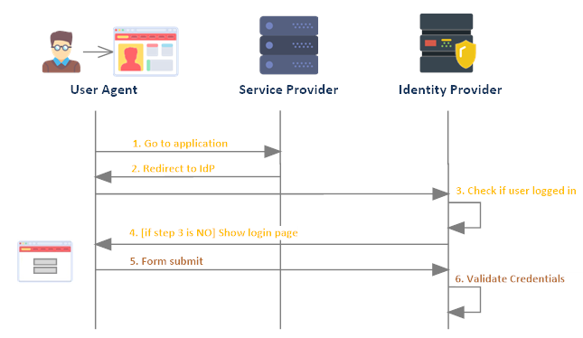
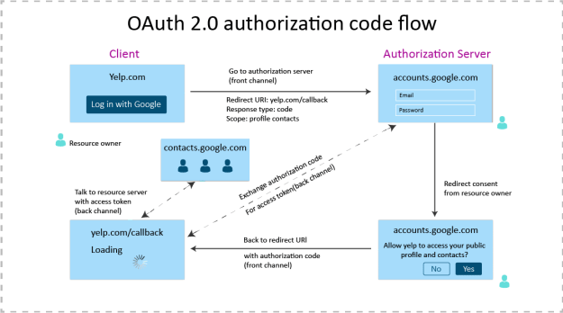
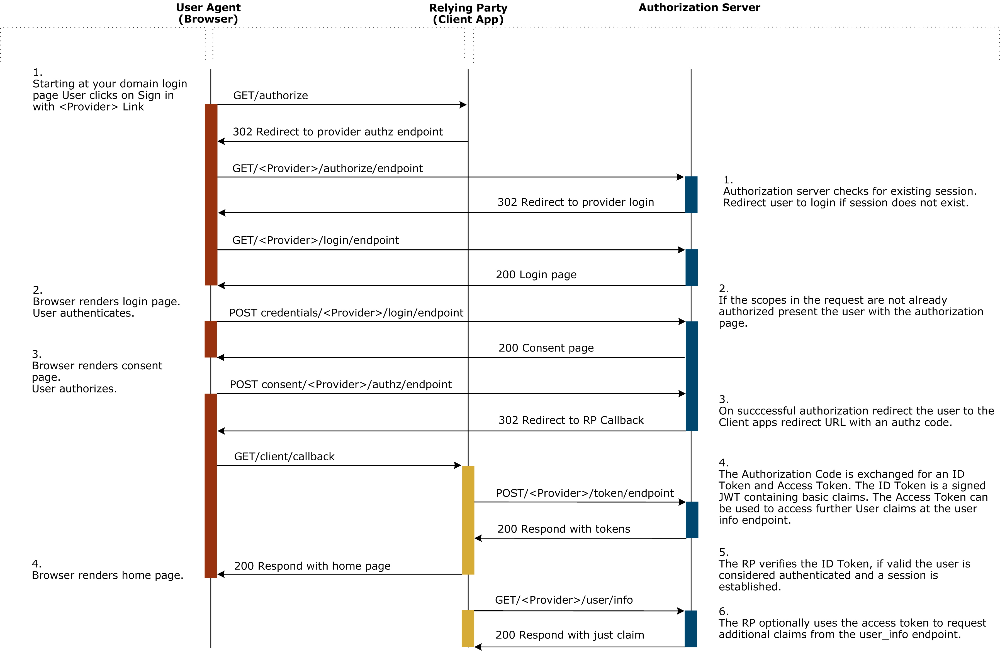

# OIDC and OAuth2.0
Correct authentication and authorization plays a big part in the security setup of today's systems. Some years ago, OAuth2.0 emerged as the standard protocol for authorization. This lead to quite some twisted use casers of OAuth to support authentication. This is way another layer on top of OAuth, named OpenID Connect, was defined. OIDC takes of the authentication part while OAuth takes care of the authorization part.

## Authentication vs authorization
Authentication and authorization, commonly referred to as authn and authz, are quite often used interchangeably. However, they are not synonyms. Authentication refers to the process of ensuring enough trust to assume that the user says he is who he is. For one application, a username and password could be enough proof, while for another application a retina scan is required. Authorization refers to the permissions a user has. We might need to access some resources from a third-party service for which we need the correct authz. The IdP ensures that we can access those resources by asking the user to authorize our service to access these resources.

## Identity Providers
Identity providers, commonly abbreviated as IdP, take care of the authentication and authorization flow of applications and provide a single sign on mechanism. When using an IdP, it's possible to __outsource__ your authn and authz flow to this IdP. The IdP in turn then ensures you that the user is who he says he is and has the correct authorizations to perform the specified actions. Most IdP's support the OIDC protocol. 

## Resource owners
When requesting authz from a user, we're effectively asking the user access to certain resources. For example, we might refer the user to Google's IdP to authorize our service to access some of the user's data on Google's servers. The user will be prompted to authorize the request after which our service can access the user's resources. This is why we commonly refer to this user as the __resource owner__. He owns the resources that our service is requesting from Google.

## Resource providers
Continuing with the same example, we request Google to send us the resource owner's data. The Google service which we use to retrieve these resources is referred to as the __resource provider__. 

## Relying parties
In the Google example, our service relies on the Google service which acts as a resource provider to provide us with the requested resources. Because of this, our service __relies__ on the Google service. That's why our service is called a __relying party__ in this case.

## OAuth2.0
As mentioned, OAuth2.0 is the standard protocol for authz nowadays. It works via access tokens and authorization codes. When a user needs to authorize some actions, such as retrieving data, the service will redirect the user to the IdP which will ask the user to authenticate himself and authorize the actions. The user will then be redirected back to the service with a so-called __authorization code__. The service can then use this code to retrieve an __access token__ from the IdP. If the service then needs to access some other service to request some resources, it can send this __access token__ with the request. The __resource provider__ will then check the access token with the IdP to ensure that the __bearer__ of this access token, which is our service, has the correct authorization to access these resources. If the IdP answers positively, the resource provider will then send back the requested resources.

Note that the flow described above only takes care of the authz part, even if the user has to authenticate himself. The service only receives an access token which handles authorizations. He doesn't have any proof of the identity of the user even though the user authenticated himself to authorize the actions. The only thing the service can deduce from the access token, is that the user has access the requested resources, not who the user is.

## ID Token
To add authentication to the OAuth2.0 flow described above, another layer called __OIDC__ was added on top of the OAuth2.0 protocol. When using OIDC, the IdP will also send back an ID token when the service request the access token with the authorization code. This ID token can then be seen as proof of the identity of the user and contains some data about the user.

