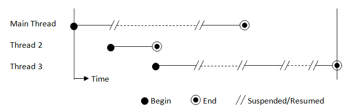

# Concurrency
Concurrency is an elementary part of today's computing. Users expect fast, optimized applications and concurrent execution. This chapter will introduce the Java concurrency model and terms. 



## Processes 
There are two basic units of execution: __processes__ and __threads__. Java concurrency is mostly concerned with threads but processes do play a big part.
A computer normally has several active threads and processes. Even in single core systems, time slicing is applied to enable concurrency.

A process executes in a self-contained environment. It doesn't use any shared resources but relies on its own pool. In particular, it has its own 
memory space. Most operating systems support several IPC (inter process communication) mechanisms such as pipes and __sockets__. Most JVMs run as a single process. If you want to define a process in terms of threads; a process is the instance of a computer program that is being executed by one or more threads. 

## Threads
Threads are no more than __sequential instructions__ to be executed. Sometimes they are called lightweight processes because the creation of threads require fewer resources than the creation of processes. Threads exist within a process, using the process's resources, such as memory and open files. This means that all threads share __the same memory__ which enables efficient, but problematic communication. Please note that every process has at least one thread (the main thread).

Each thread is associated with a Thread object. These objects are used in two basic strategies:
- Manually manage Thread objects when needed
- Pass the management responsibilities to an executor

When creating a Thread object, you need to pass the executable code to this new Thread object. Most commonly, this is done with the Runnable interface:
```java
public class MyRunnable implements Runnable {
    @Override
    public void run() {
        System.out.println("Hello world!");
    }
}

public static void main(String args[]) {
    new MyThread(new MyRynnable()).start();
}
```

Or via the lambda way:
```java
new Thread(() -> System.out.println("Hello world!")).start();
```

Another way is subclassing the Thread class, which implements the Runnable interface as well:
```java
public class MyThread extends Thread {
    @Override
    public void run() {
        System.out.println("Hello world!");
    }
}

public static void main(String args[]) {
    new MyThread().start();
}
```

The Thread class provides a number of util functions useful for thread management. Some of these are static methods which provide information, or modify,
the thread from which the function was called.

A commonly used function is the __Thread.sleep()__ method. This pauses the thread for a specified amount of time. However, this time is not guaranteed to be precise because of dependencies on the underlying operating system. Also note that the sleep period can be interrupted. In short: don't assume that the thread will pause for the specified amount of time.

Another commonly used function is the __Thread.join() method__. The join() method allows a thread to wait for the completion of another thread. If t is a thread, then t.join() will instruct the invoking thread to pause execution untill t is finished.

### Memory
Because all threads use the same memory, they have access to the __same heap space__ when executing in a JVM. This means that objects, global state (such as static fields), arrays et cetera can be shared among threads. Shared state can impose many problems though, such as __false sharing__ and __race conditions__. More on that later.

Each thread running in the JVM has its own __thread stack__. This stack contains information about the methods which were called to reach the current point of execution. Whenever a method is called, this method call is enveloped in a __frame__ together with its local variables and placed upon the stack. If an object on the heap is needed, a reference to this object is included in the frame. When the method returns, this frame is popped and the next frame continues with its execution. This stack is only used by the executing thread and thus __can't be shared__ among multiple threads. This enables threads to run concurrently and independently while executing the same in-memory instructions (remember that the process's memory is shared).


### Interrupts
An interrupt is an indication to a thread that it should __seize its current work__ and do something else. In most cases, this means that the thread will 
terminate. A thread can send an interrupt signal to another thread by invoking the __interrupt()__ method on the Thread object representing this thread. For the interruption to work correctly, the interrupted thread should support its own interruption.

There are two common ways to support interruptions in your thread:
- Frequently call methods which throw an InterruptedException
- Check the interrupted flag

Thread.sleep() is a common example of a method which throws an __InterruptedException__:
```java
for (int i = 0; i < 10; i++) {
    try {
        Thread.sleep(1000);
    } catch (InterruptedException e) {
        return;
    }
}
```

As mentioned, you could also check the interrupted flag:
```java
for (int i = 0; i < 10; i++) {
    if (Thread.interrupted()) {
       throw new InterruptedException();
    }
}
```

The interrupt mechanism is implemented using a __status flag__. Everytime the __Thread.interrupted()__ method is called or an __InterruptedException__
was thrown, this flag is cleared as we can safely assume that the interruption has been handled. A thread can also check the interrupted status of another
thread by using the non-static __isInterrupted()__ method. This does not clear the current flag.

### Daemon threads
A daemon (or system) thread in the Java world is a thread that does not prevent the JVM from exiting before the thread is finished. These are typically long-lived, background threads which provide services to the user threads. An example of a daemon thread is the __garbage collector.__ The JVM will exit when all __user threads__ have finished and kill off any remaining daemon threads.

## Synchronization
Threads communicate primarily by sharing access to fields and their references. This can be quite dangerous, __memory consistency errors__ (race conditions)and __thread interferences__ can and probably will occur if not enough care is taken. __Synchronization__ is a tool used to prevent these errors. However, synchronization can introduce other errors, mostly to do with __thread contention__ such as __deadlocks__ and __starvation__. Synchronization is the method to synchronize threads' access to certain data if needed. We can manage this access such that threads always execute in order when working on the same data.

### Thread interference
Interference happens when two threads acting on the same data __interleave__. In other words: the instructions for their operations overlap. Consider the following example:
```java
class Counter {
    private int c = 0;

    public void increment() {
        c++;
    }

    public void decrement() {
        c--;
    }

    public int value() {
        return c;
    }
}
```

You'll notice two methods which change state in the above example: increment() and decrement(). On first sight, it's impossible for these methods to interleave; they both call different instructions. But when decomposing these instructions, you'll notice several overlapping steps. The steps for the __c++__ instruction look like the following:
1. Retrieve the value from the __c__ variable
2. Increment this value
3. Store this value in the pre-defined destination

The steps for the __c--__ instruction look simular, except we decrement the value instead of incrementing it.

This opens up the possibility for thread interference; thread A could have incremented the value of the __c__ variable while thread B has been decrementing it. The result of thread A's actions would be lost in this case.

Bugs like this are hard to detect and fix. The results are very unpredictable; sometimes its thread A's result that will be lost, another time it will be thread B's result and yet another time the outcome is as expected. You can't predict the execution order of your threads if no special measures are being taken.


### Memory concistency
As mentioned before, threads share the same data and memory. However, in most architectures there are no guarantees about __when__ modified data will be visible to other threads. In other words; we can't know when thread A's modifications to a field will be visible to thread B. The only thing that we can know is that write operations happen in order from the perspective of the CPU. If thread A declares a write statement on the field, after which thread B executes a write statement on this field, the CPU guarantees that thread A's write will happen before thread B's write. Memory consistency errors happen when different threads have different views of the same data. Let's say we have thread A which modifies a field called counter. We also have a thread B which prints the value of this field. There is no guarantee that the printout in thread B will print the modified value since we don't know __when__ the value in this field will be changed. We could get the value before modification or we could get the modified value.

There can be several reasons for the visibility of the modification to be variable. For example, when working with multiple (virtual) cores, it's possible that the threads are working with different __CPU caches__. These caches have to be synchronized with each other to enforce the idea to the programmer that the threads are working on the same data. This synchronization is a variable factor because it's dependent on a lot of external variable factors.


The key to avoiding these issues is to have a solid understanding of the __happens before__ relationship. When a programmer says 'I've established a happens before relationship' he simply means that it's guaranteed that the memory writes of a specific statement are visible to the other statements. The memory write __happens before__ the other statements are executed.

We have already seen two actions that establish a happen before relationship:
- Thread.start(): all statements that were executed before the Thread.start() call happen before the execution of the instructions in this thread
- Thread.join(): all statements in the terminated thread happen before the yet-to-be-executed statements in the joining thread

### Synchronizing methods and statements
Synchronization can happen on two levels: on the method level and on the statement level. To make a method __synchronized__, simply add the __synchronized__ keyword to its declaration:
```java
class Counter {
    private int c = 0;

    public synchronized void increment() {
        c++;
    }

    public synchronized void decrement() {
        c--;
    }

    public synchronized int value() {
        return c;
    }
}
```

The synchronized keyword works on object level. If thread A enters a synchronized method on object B of the Counter class, thread B will have to wait before it can execute another synchronized method on object B. It effectively puts a lock for all synchronized method-calls on object B.