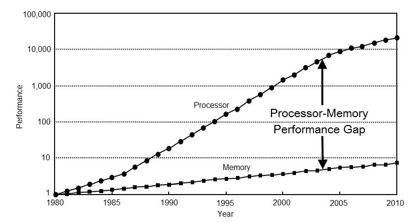
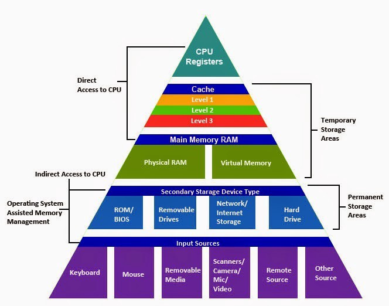
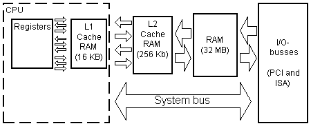

# Memory
In this day and age, most programmers don't encounter many memory issues anymore. Everything is solved and kept safe at the hardware level. However, I do believe that having some general knowledge about the magic of the memory model, architecture and mechanisms will make a programmer better understand (and predict) what he's doing and therefore produce better code.

## Memory hierarchy
The time taken to fetch some data from the memory is often a huge bottleneck in today's computers. As CPU's became faster and more efficient, memory stalled which resulted in a big difference between the speed of which the CPU is able to execute instructions and the speed of which memory is able to read and write data.



Modern processors are able to execute hundreds of cycles in the time it takes to fetch or write some data from or to our main memory. When the CPU runs out of things to do, we call it a __stall__. Stalls might happen a lot if we don't employ some advanced techniques to keep the CPU busy. __Out-of-order__ CPU's attempt to keep the CPU busy by executing independent instructions after the instruction which is waiting for memory access. Intel mostly employs its __hyperthreading__ mechanism which boils down to allowing a second process to use the CPU while the first process is waiting for memory access.

Another workaround is the fairly complex memory hierarchy modern computers employ. There are different levels of memory with different latency and size. The notion of __fast and large memory__ is reached by very complex interactions between these different levels and the concept of locality. 



In the context of our __memory hierarchy__, you can view every level of memory as a cache for the level below. If we call L1 level k, then we can say that level k is a cache for level k+1 which is L2. We can also safely assume that access times get longer the lower we go in our memory hierarchy with the top being our CPU registers. Whenever some data or instructions are needed, the memory hierarchy will be traversed from top to bottom. If we encounter our data or instruction at level k, we assume this is the correct data or instruction and won't look further in level k+1. As mentioned, the interactions between these different levels can become fairly complex. A couple of questions arise; how do we synchronize these caches in a multi-core setup? When do we cache some data in a lower level? How do we synchronize the lower levels with the higher levels? These are the questions this chapter aims to answer. 

## CPU caches
Our modern computers all utilize some form of __CPU caching__. These caches are not only made up of better memory (SRAM vs DRAM), but are also physically closer to the CPU resulting in lower latency. 

Every entry in the cache consists of an __index__, a __tag__ and a __cache line__. An index is simply an index number to order the entries. The tag points to the memory location which is cached in this entry. The cache line contains the cached data or instructions. Everytime the CPU requests some data or instructions, it will check the cache for any equivalent entries by checking the tags. If an entry was found, we call it a __cache hit__ and the CPU directly reads or writes from or to this cache line. If an entry wasn't found, we call it a __cache miss__. The resulting data from the memory will then be written into a new cache entry. The ratio of these hits and misses is known as the __hit rate__.

It's not possible to read individual bytes from the cache, the atomic unit of access are the so-called cache lines. In most everyday computers, these cache lines are 64 bytes long. This means that everytime the CPU fetches some data from the memory and stores it in the cache, it will be units of 64 bytes. This might include unnecessary data which happened to be a neighbour of the requested data in memory.

As mentioned, when the CPU encounters a __cache miss__, a new entry in the cache will be created. To make room for this new entry, an old entry will be evicted from the cache. The heuristic that the cache uses to choose the entry to evict is called the __replacement policy__. The big problem of choosing the entry to evict is the fact that we can't know the future. Of course, we'll want to evict the least useable entry, but how do we decide which entry will be used the least in the future?Therefore, the most commonly used replacement policy (LRU) simply evicts the entry which was used the least recently.

There are generally three types of cache misses:
- Cold miss: the cache is empty
- Conflict miss: an entry wasn't cached because it was evicted as its index was needed by an entry in the same subset (associativity)
- Capacity miss: occurs when the set of active cache blocks (working set) is larger than the cache

Of course, the main memory needs to be synchronized with the cache. Whenever we write a new entry to the cache from the CPU, this entry needs to be transferred to the main memory. The policy which decides the timing of this synchronization is called the __write policy__. These policies can generally be divided in two categories:
- __Write through__ caches: every write to the cache causes a write to the main memory
- __Write back__ caches: writes are not immediately mirrored to the main memory. Only when an entry is set to be evicted, it will be written to the main memory. This has the consequence that on a cache miss, two main memory accesses need to happen; one to write the dirty (to be evicted) line, and one to create the new cache entry.



We also need to synchronize between the caches in a multi-core setup. If a process updates some data which was cached, this change needs to reflect in the cache of other cores which contain the same data. The mechanisms which the cache managers employ to keep their data consistent are known as __coherency protocols__.

### Associativity
As mentioned before, the __replacement policy__ decides where the new entry will be written to in the cache. If this policy is free to decide where to write the entry to in the cache, we call it a __fully associative__ cache. The other extreme is a one on one mapping between a new entry and a potential location. This is called __direct mapping__. Many caches implement a compromise, which offers a certain amount of possible locations for a new entry. We call this __set associative__. 

This poses a new problem; how do we decide in which locations the new entry can be stored? A common solution to this problem is the use of the least significant bits. If we have a cache of 256KB and a cache line of 64 bytes, we have around 4000 possible indices which can be represented by 12 bits. We can then use the 12 least significant bits of the memory address to retrieve the location of the entry to-be-stored. This means that every multiple of these 12 least signifcant bits has to share this index. Let's say we need to read some data from our main memory located at index 345981831. This results in the binary number 10100100111110100001110000111 with 001110000111 as the least significant bits which translate to index 903 in our cache. Every index in our main memory which is a result of __x * 903__ will be stored in the same cache index if we use a __directly mapped__ cache. In a set associative cache we might have multiple storage boxes at this index. 


Associativity is a trade-off. When there are, for example, ten possible locations for a cache entry, all these ten places must be searched when checking for a cache hit. On the other hand, cache misses will be rarer as entries will have to be evicted less times because of conflicting main memory indices.

A big advantage of a __directly mapped__ cache is that it allows fairly simple and fast speculation. When some data or instructions from memory are requested, we can easily know the equivalent cache index. This allows for some speculation in parallelly checking the tag of this entry and continuing the instruction with the data found in this cache entry.

### Locality
Caches are based on the principles of temporal and spatial locality. The __principle of locality__ states that processes tend to reuse data and instructions near those that they have used recently. There are two types of locality:
- __Temporal locality__: recently referenced items are likely to be referenced again in the near future
- __Spatial locality__: items with nearby physical addresses tend to be used together close in time

As an example, consider following snippet:
```java
int[] a = ...
int sum = 0;
for (i = 0; i < a.length; i++) {
    sum += a[i];
}
return sum;
```
Pictured above is a very basic snippet of code; a variable declaration and initialization and a for loop. Even in this simple snippet, temporal and spatial locality is used. The sum variable is reused over and over in the for loop: __recently referenced items are likely to be reused again__. We also traverse over the full 'a' array: __nearby physical addresses are likely to be used close together in time__. The notion of addressinng every value in an array is called a stride-1 reference pattern. We loop over the array one by one. You should always strive for as low a stride pattern as possible as this'll improve spatial locality. Note that array values are stored next to each other in memory. 

The same principles apply to the instructions; we iterate over the instructions sequentially which results in a tighter spatial locality. We also cycle through the loop repeatedly which results in tighter temporal locality.

Tighter locality will improve the cache rate which in return improves the latency of our memory access. The entries in our caches will be reused because of our temporal locality while we can intuitively prefetch needed data or instructions in the future because of our spatial locality.

From the above observations we can conclude that __well written programs have good locality, both spatial and temporal__.

